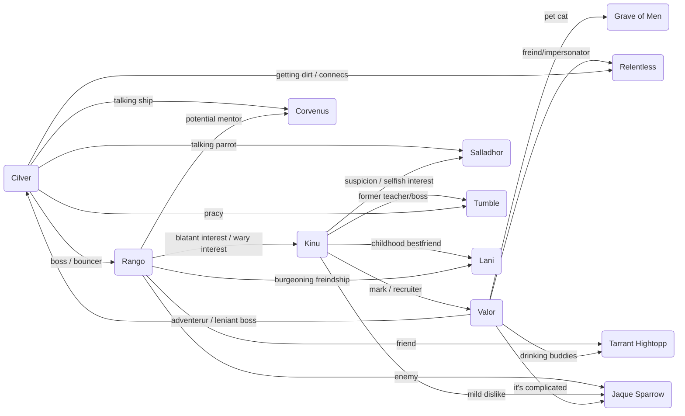

```mermaid
graph LR

a(Cilver)
b(Rango)
c(Kinu)
d(Valor)

aa(Salladhor)
ab(Corvenus)
ba(Tarrant Hightopp)
bb(Jaque Sparrow)
ca(Tumble)
cb(Lani)
da(Grave of Men)
db(Relentless)

a-->|boss / bouncer| b
b-->|blatant interest / wary interest| c
c-->|mark / recruiter| d
d-->|adventerur / leniant boss| a


a-->|talking parrot| aa
a-->|talking ship| ab

b-->|friend| ba
b-->|enemy| bb

c-->|former teacher/boss| ca
c-->|childhood bestfriend| cb

d-->|pet cat| da
d-->|freind/impersonator| db

a-->|pracy| ca
a-->|getting dirt / connecs| db

b-->|potential mentor| ab
b-->|burgeoning freindship| cb

c-->|mild dislike| bb
c-->|suspicion / selfish interest| aa

d-->|drinking buddies| ba
d-->|it's complicated| bb
```

Scratch that, use this:

![[Dre Web.drawio]]